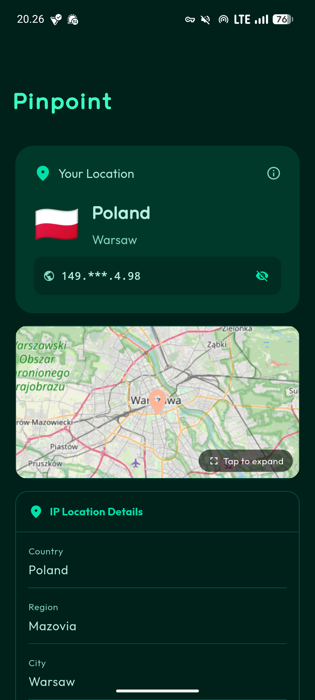
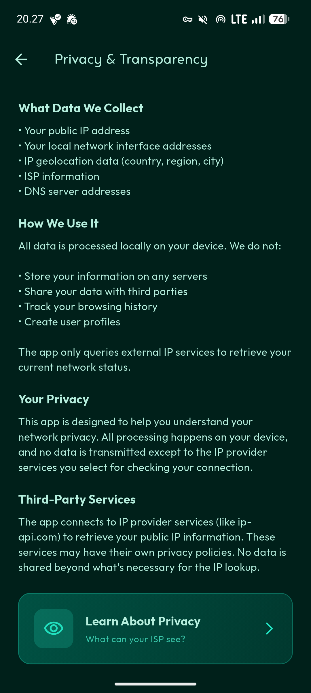

[](https://github.com/alfahrelrifananda/pinpoint/releases)
[](https://flutter.dev)
[](LICENSE)

# Pinpoint

A network information app built with Flutter. Check your public IP, detect VPN/Tor usage, and assess your network privacy.

[](https://github.com/alfahrelrifananda/pinpoint/releases)

## Features

- Detect your public IP address with geolocation
- Identify VPN or Tor network usage
- View local network interface details
- Check for potential privacy leaks
- Add custom IP lookup providers
- All data processed locally on your device

## Screenshots

<div style="display: flex; justify-content: space-around; gap: 10px;">
  
  
  
</div>

## Tech Stack

- **Language:** Dart
- **Framework:** Flutter
- **UI:** Material Design 3
- **State Management:** StatefulWidget with AutomaticKeepAliveClientMixin
- **Network:** HTTP package
- **Storage:** SharedPreferences

## Getting Started

### Prerequisites

- [Flutter SDK](https://flutter.dev/docs/get-started/install) 3.0+ (latest stable version)
- Android Studio or VS Code with Flutter extensions
- Android device or emulator (API 24+)

### Installation

1. Clone the repository:
   ```bash
   git clone https://github.com/alfahrelrifananda/pinpoint.git
   cd pinpoint
   ```

2. Install dependencies:
   ```bash
   flutter pub get
   ```

3. Run the app:
   ```bash
   flutter run
   ```

### Build for Production

```bash
# Android
flutter build apk --release

# iOS
flutter build ios --release

# Web
flutter build web --release
```

## Usage

- Launch the app to check your network status
- Pull down to refresh or use the refresh button
- Access settings to add custom IP lookup providers
- View detailed information about your network privacy

## Detection Methods

### VPN Detection
- ISP and organization name analysis
- Pattern matching for known VPN providers
- Hosting provider identification
- ASN validation

### Tor Detection
- Organization name checking
- Tor Project API validation
- Third-party service verification
- Known Tor ASN database

## Privacy

All data is processed locally on your device. The app uses third-party IP lookup services to gather network information, but nothing is sent to our servers.

## Contributing

If you'd like to contribute:
- Fork the project
- Open issues for bugs or feature requests
- Submit pull requests
- Follow [Effective Dart](https://dart.dev/guides/language/effective-dart) guidelines

## License

This project is licensed under the **GNU General Public License v3.0**. See the [LICENSE](LICENSE) file for details.
